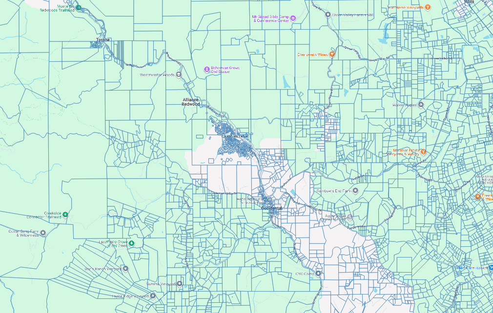
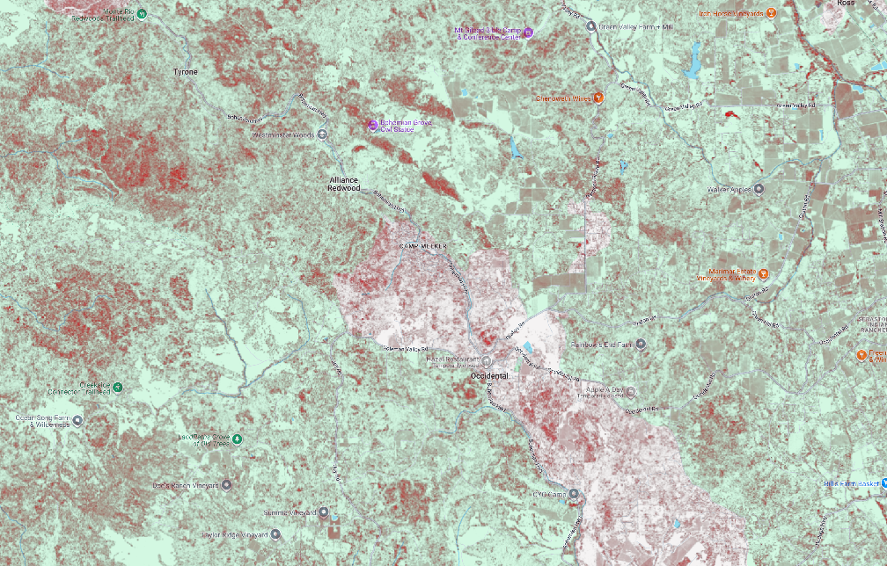
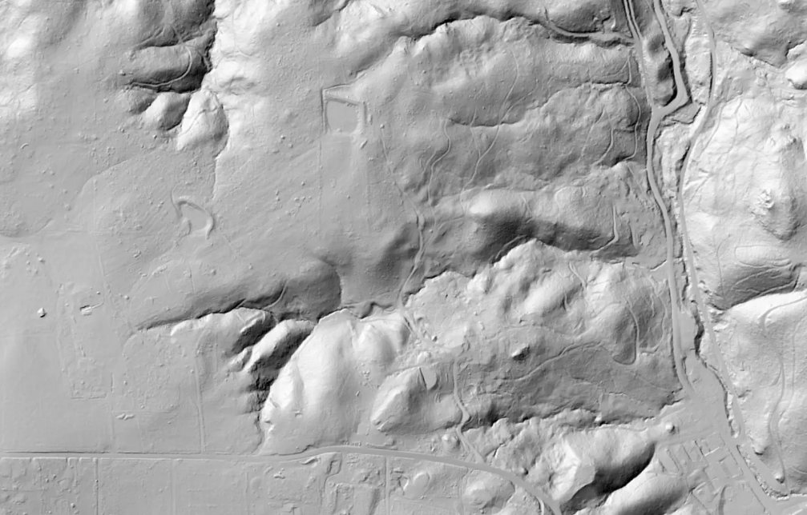
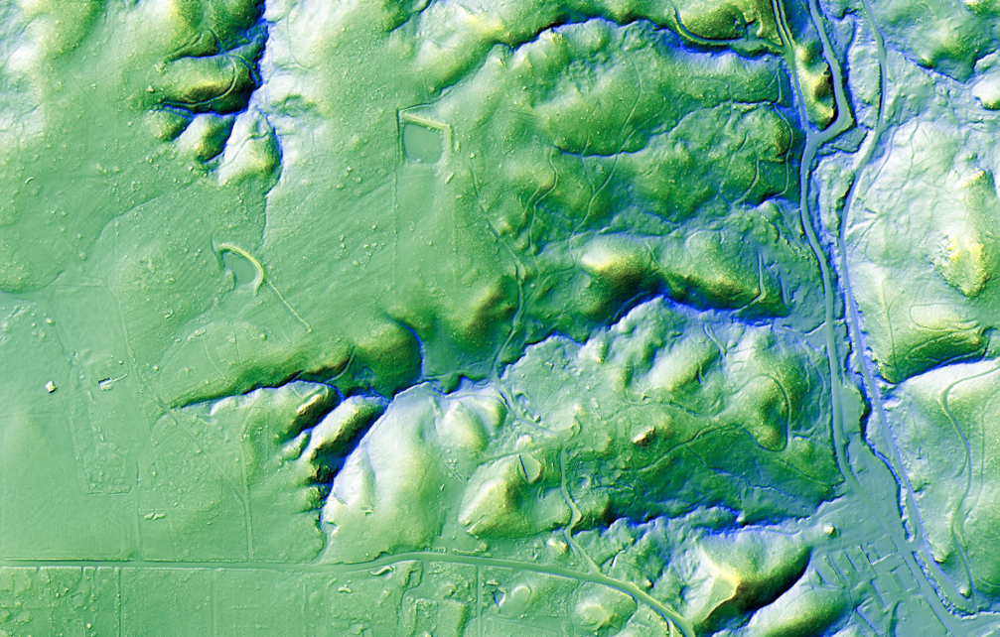
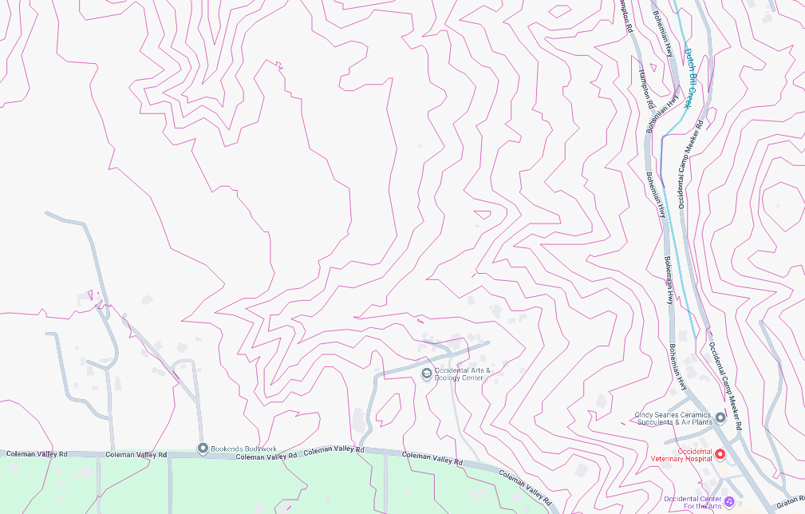
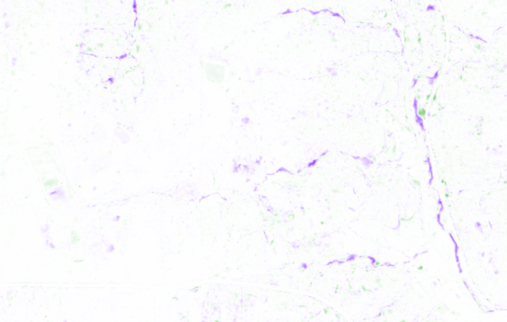
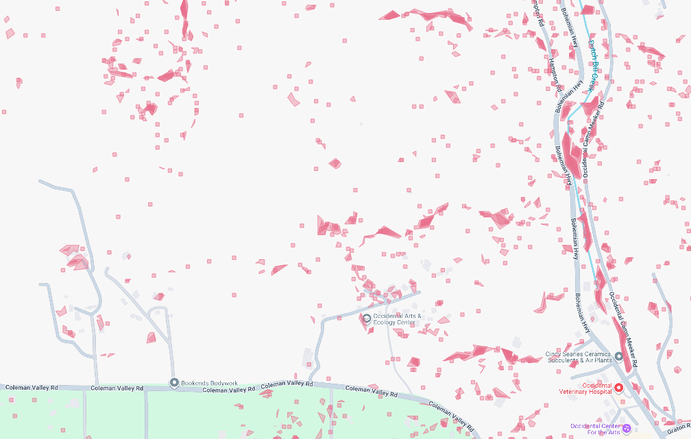
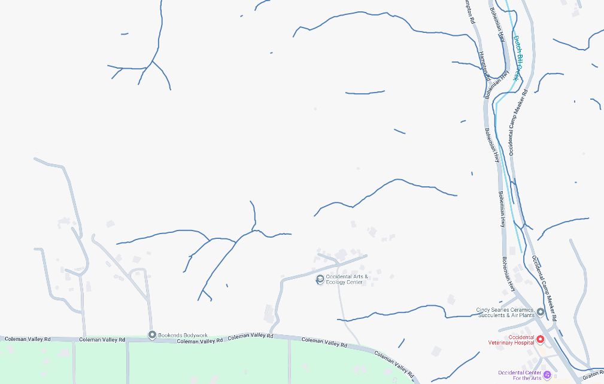
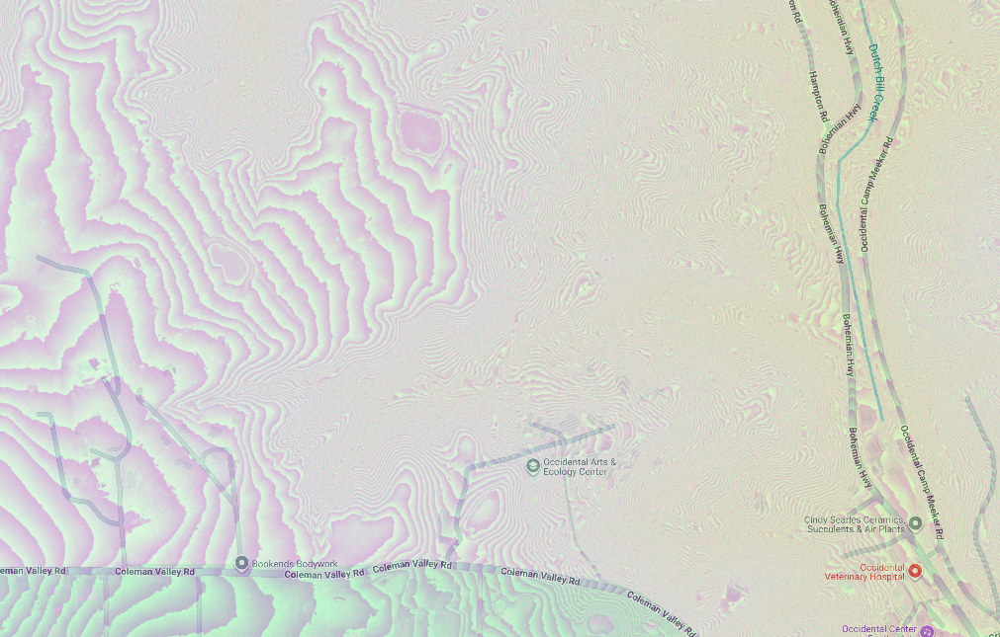

# oaec-found-gully

Intro text...

# Data products

## sonoma-county-parcels

* [https://uchicago-dsi-oaec.s3.us-east-1.amazonaws.com/sonoma-county-parcels.pmtiles](https://uchicago-dsi-oaec.s3.us-east-1.amazonaws.com/sonoma-county-parcels.pmtiles) (26.5 MB)
* `http://localhost:8080/data/sonoma-county-parcels/{z}/{x}/{y}.pbf`
* format: PBF
* zoom: 0..14
* bounds: -123.532896, 38.11246, -122.350206, 38.8527739
* layer: `parcels`
* fields: `parcel`, `type`, `description`, address`, `city`

## sonoma-county-ladder-fuels-4m and 8m

* [https://uchicago-dsi-oaec.s3.us-east-1.amazonaws.com/sonoma-county-ladder-fuels-4m.pmtiles](https://uchicago-dsi-oaec.s3.us-east-1.amazonaws.com/sonoma-county-ladder-fuels-4m.pmtiles) (54.3 MB)
* [https://uchicago-dsi-oaec.s3.us-east-1.amazonaws.com/sonoma-county-ladder-fuels-8m.pmtiles](https://uchicago-dsi-oaec.s3.us-east-1.amazonaws.com/sonoma-county-ladder-fuels-8m.pmtiles) (60.8 MB)
* `http://localhost:8080/data/sonoma-county-ladder-fuels-4m/{z}/{x}/{y}.webp`
* `http://localhost:8080/data/sonoma-county-ladder-fuels-8m/{z}/{x}/{y}.webp`
* format: WEBP
* tile size: 512
* zoom: 0..13
* bounds (4m): -123.5532079, 38.1057112, -122.3286212, 38.8578298
* bounds (8m): -123.5532079, 38.1057112, -122.3286212, 38.8578298

## hillshade-2022-greyscale

* [https://uchicago-dsi-oaec.s3.us-east-1.amazonaws.com/hillshade-2022-greyscale.pmtiles](https://uchicago-dsi-oaec.s3.us-east-1.amazonaws.com/hillshade-2022-greyscale.pmtiles) (2.9 GB)
* `http://localhost:8080/data/hillshade-2022-greyscale/{z}/{x}/{y}.webp`
* format: WEBP
* tile size: 512
* zoom: 9..18
* bounds: -123.5416832, 38.0989466, -122.3315485, 38.8578298

## hillshade-2022-color-enhanced

* [https://uchicago-dsi-oaec.s3.us-east-1.amazonaws.com/hillshade-2022-color-enhanced.pmtiles](https://uchicago-dsi-oaec.s3.us-east-1.amazonaws.com/hillshade-2022-color-enhanced.pmtiles) (149.0 GB)
* `http://localhost:8080/data/hillshade-2022-color-enhanced/{z}/{x}/{y}.png`
* format: PNG
* tile size: 512
* zoom: 9..18
* bounds: -123.5416832, 38.0989466, -122.3315485, 38.8578298
* alternate format: [hillshade-2022-color-enhanced.tif](https://uchicago-dsi-oaec.s3.us-east-1.amazonaws.com/hillshade-2022-color-enhanced.tif) (51.5 GB)

## elevation-2022-contours

* [https://uchicago-dsi-oaec.s3.us-east-1.amazonaws.com/elevation-2022-contours.pmtiles](https://uchicago-dsi-oaec.s3.us-east-1.amazonaws.com/elevation-2022-contours.pmtiles) (17.7 GB)
* `http://localhost:8080/data/elevation-2022-contours/{z}/{x}/{y}.pbf`
* format: PBF
* zoom: 9..24
* bounds: -123.534363, 38.115357, -122.35339, 38.853807
* layer: `contours`
* fields: `level`
* alternate format: [elevation-2022-contours.geojson.zip](https://uchicago-dsi-oaec.s3.us-east-1.amazonaws.com/elevation-2022-contours.geojson.zip) (5.0 GB)

## elevation-2022-minus-2013

* [https://uchicago-dsi-oaec.s3.us-east-1.amazonaws.com/elevation-2022-minus-2013.pmtiles](https://uchicago-dsi-oaec.s3.us-east-1.amazonaws.com/elevation-2022-minus-2013.pmtiles) (5.7 GB)
* [https://uchicago-dsi-oaec.s3.us-east-1.amazonaws.com/elevation-2022-minus-2013.tif](elevation-2022-minus-2013.tif) (10.3 GB)
* `http://localhost:8080/data/elevation-2022-minus-2013/{z}/{x}/{y}.png`
* format: PNG
* tile size: 512
* zoom: 12..16
* bounds: -123.5416832, 38.0989466, -122.3315485, 38.8578298

## elevation-2022-minus-2013-contours

* [https://uchicago-dsi-oaec.s3.us-east-1.amazonaws.com/elevation-2022-minus-2013-contours.pmtiles](https://uchicago-dsi-oaec.s3.us-east-1.amazonaws.com/elevation-2022-minus-2013-contours.pmtiles) (11.8 GB)
* `http://localhost:8080/data/elevation-2022-minus-2013-contours/{z}/{x}/{y}.pbf`
* format: PBF
* zoom: 9..24
* bounds: -123.534602, 38.109024, -122.348627, 38.853763
* layer: `contours`
* fields: `level`
* alternate format: [elevation-2022-minus-2013-contours.geojson.zip](https://uchicago-dsi-oaec.s3.us-east-1.amazonaws.com/elevation-2022-minus-2013-contours.geojson.zip) (3.0 GB)

## gully-detection-pass2

* [https://uchicago-dsi-oaec.s3.us-east-1.amazonaws.com/gully-detection-pass2.pmtiles](https://uchicago-dsi-oaec.s3.us-east-1.amazonaws.com/gully-detection-pass2.pmtiles) (842.8 MB)
* `http://localhost:8080/data/gully-detection-pass2/{z}/{x}/{y}.png`
* format: PNG
* tile size: 512
* zoom: 0..16
* bounds: -123.5428349, 38.1033256, -122.3328823, 39.242092

## gully-detection-pass3-graph

* [https://uchicago-dsi-oaec.s3.us-east-1.amazonaws.com/gully-detection-pass3-graph.pmtiles](https://uchicago-dsi-oaec.s3.us-east-1.amazonaws.com/gully-detection-pass3-graph.pmtiles) (33.6 MB)
* `http://localhost:8080/data/gully-detection-pass3-graph/{z}/{x}/{y}.pbf`
* format: PBF
* zoom: 9..16
* bounds: -123.533896, 38.117104, -122.357284, 38.85363
* layer: `gully_detection_pass3_graph`
* fields: _(none!)_
* alternate format: [gully-detection-pass3-graph.parquet](https://uchicago-dsi-oaec.s3.us-east-1.amazonaws.com/gully-detection-pass3-graph.parquet) (47.9 MB)

## elevation-2013 and elevation-2022

* [https://uchicago-dsi-oaec.s3.us-east-1.amazonaws.com/elevation-2013.pmtiles](https://uchicago-dsi-oaec.s3.us-east-1.amazonaws.com/elevation-2013.pmtiles) (11.7 GB)
* [https://uchicago-dsi-oaec.s3.us-east-1.amazonaws.com/elevation-2022.pmtiles](https://uchicago-dsi-oaec.s3.us-east-1.amazonaws.com/elevation-2022.pmtiles) (10.4 GB)
* `http://localhost:8080/data/elevation-2013/{z}/{x}/{y}.png`
* `http://localhost:8080/data/elevation-2022/{z}/{x}/{y}.png`
* format: PNG
* tile size: 256
* zoom: 17..17
* bounds (2013): -123.5479195, 38.0969493, -122.343146, 39.2461077
* bounds (2022): -123.5416832, 38.0989466, -122.3315485, 38.8578298
* alternate format: [elevation-2013.tif](https://uchicago-dsi-oaec.s3.us-east-1.amazonaws.com/elevation-2013.tif) (64.8 GB)
* alternate format: [elevation-2022.tif](https://uchicago-dsi-oaec.s3.us-east-1.amazonaws.com/elevation-2022.tif) (62.8 GB)

